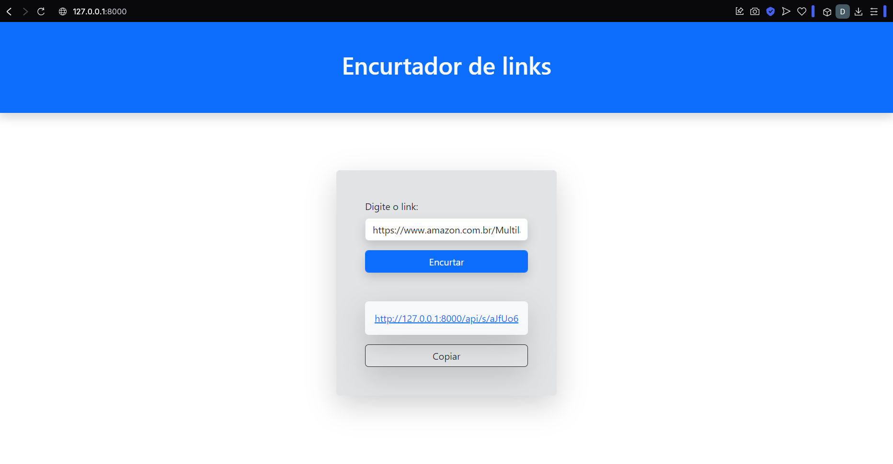

# Encurtador de links com Java☕



> Projeto simples armazena e encurtar diversos tipos de links como urls de produtos da amazon, aliexpress, shopee e entre outros tipos permitindo serem compartilhado em redes sociais...

## Requisitos 💻

Antes de clonar o projeto e recomendado você ter os seguintes requisitos:

### BACKEND 🌑

-   Necessario ter `Java` instalado
-   Requisito `git` para clonar
-   Sua maquina `Windows, Linux ou Mac`
-   Conhecimento basico `Spring`

### FRONTEND (Opcional)☀️

-   Documentação `Bootstrap`
-   Conhecimento basico `Typescript`

## Tecnologias 🚀

As principais tecnologias e ferramentas utilizadas neste projeto são:

-   `Java`: É uma linguagem de programação orientada a objetos, multiplataforma e rápida. É utilizada para criar aplicações móveis, software empresarial, aplicações de big data e tecnologias do servidor.

-   `Typescript`: É uma linguagem de programação de código aberto, construída sobre o JavaScript. Ela foi desenvolvida pela Microsoft e é utilizada para programar aplicações web, desktop e mobile.

## Como instalar 🚀

Windows, Linux e macOS

```
git clone https://github.com/danielBRTanimacao/encurtador-de-link.git
cd encurtador-de-link

Instalar as dependencias necessarias no pom.xml
```

O projeto vem com um simples Typescript

```
cd src/main/resources/static/assets/ts
tsc
```

Automaticamente o js e gerado e ja esta injetado no codigo
